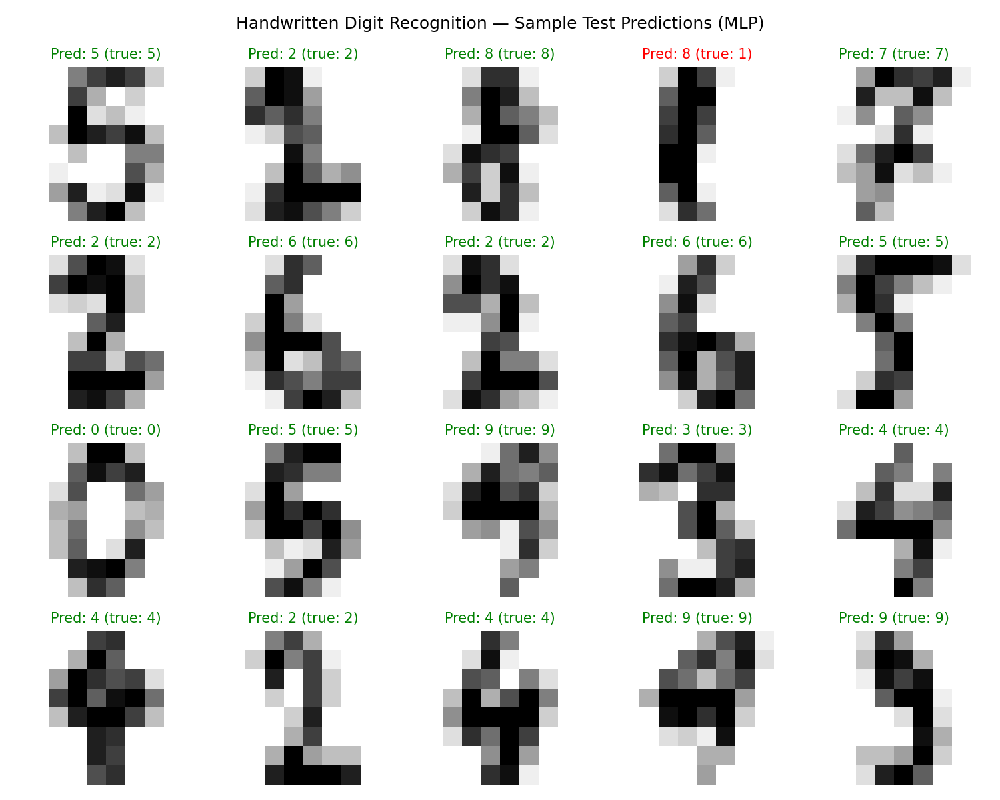
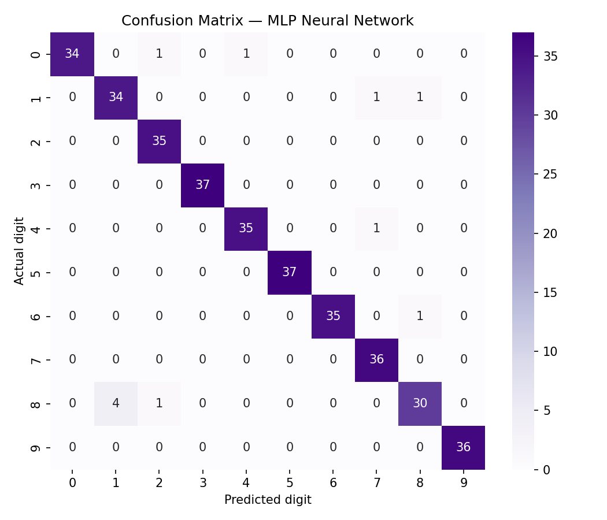

# Handwritten Character Recognition (Digits)

**Machine Learning Project**

## Problem
Handwritten digit recognition is the classic entry point to image
classification — used in cheque processing, form digitisation and postal
automation. This project trains models to recognise handwritten digits
**0–9** from images.

## Dataset
**scikit-learn Digits dataset** (real handwritten digit images from the
UCI / MNIST family of handwritten-digit data)

- 1,797 samples, each an 8×8 pixel greyscale image (64 features)
- 10 classes: digits 0–9
- Ships built-in with scikit-learn (`sklearn.datasets.load_digits`), so the
  project runs anywhere with **no download required** — chosen for reliability.
- To scale this exact pipeline to full 28×28 MNIST, swap `load_digits()` for
  `fetch_openml('mnist_784')`; everything else stays the same (see the note in
  `handwritten_recognition.py`).

## Approach
- Standard scaling of pixel values
- Train / test split: 80 / 20, stratified, `random_state=42`
- Main model: an **MLP neural network** (hidden layers 128 → 64), with two
  classical baselines for comparison

## Models Used
1. **Logistic Regression** (`max_iter=1000`) — baseline
2. **Support Vector Machine (SVM)** — RBF kernel — baseline
3. **MLP Neural Network** — `MLPClassifier(hidden_layer_sizes=(128, 64), max_iter=500)`

## Results (actual test-set results from running `handwritten_recognition.py`)

| Model | Test Accuracy |
|---|---|
| Logistic Regression | 0.9722 |
| **SVM** | **0.9750** |
| MLP Neural Network | 0.9694 |

**Conclusion:** All three models exceed 96.9% test accuracy on this dataset.
SVM was marginally best (**97.50%**), with the MLP neural network at
**96.94%** — its per-class report shows perfect scores for digits 3, 5 and 9,
with digit 8 the hardest to recognise (recall 0.8571). On the much larger
full MNIST dataset, the neural-network approach is the one that scales best.

Full metrics: [`outputs/metrics.json`](outputs/metrics.json)

## Output Plots
- Sample test predictions (green = correct, red = wrong): `outputs/sample_predictions.png`
- Confusion matrix (MLP): `outputs/confusion_matrix_mlp.png`
- Model comparison: `outputs/model_comparison.png`




## How to Run
```bash
pip install -r requirements.txt
python handwritten_recognition.py
```
Results are printed in the terminal and saved to `outputs/` (plots + `metrics.json`).

## Project Structure
```
HandwrittenCharacterRecognition/
├── handwritten_recognition.py
├── requirements.txt
├── README.md
└── outputs/
    ├── metrics.json
    ├── sample_predictions.png
    ├── confusion_matrix_mlp.png
    └── model_comparison.png
```

---
**Author: Muhammad Abdul Rafay — ML Intern**
